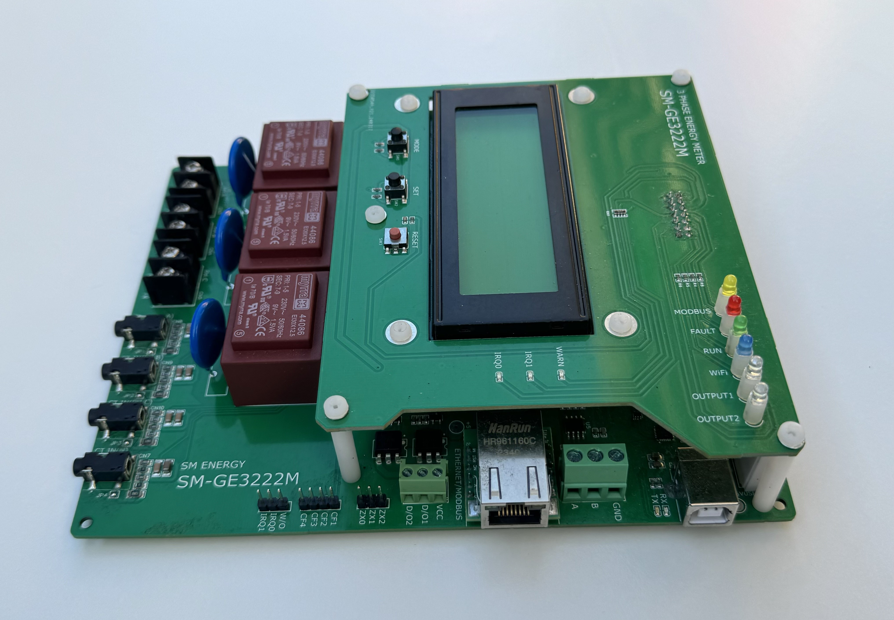
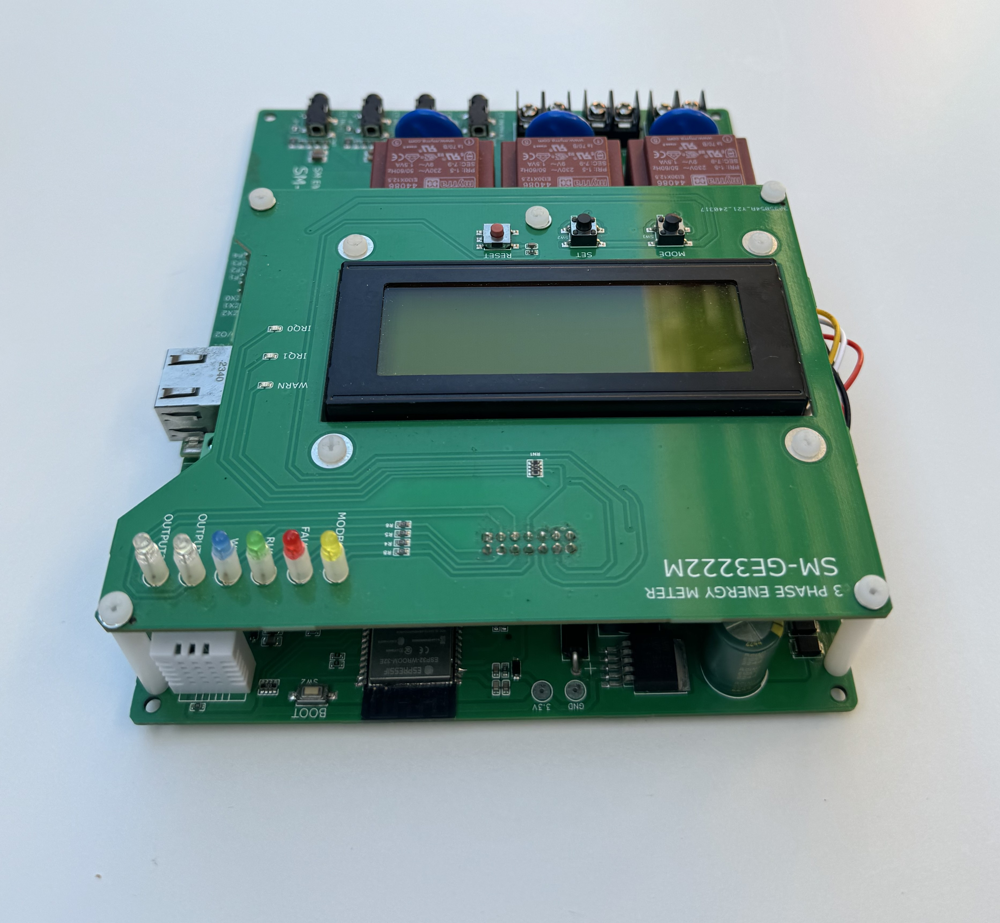
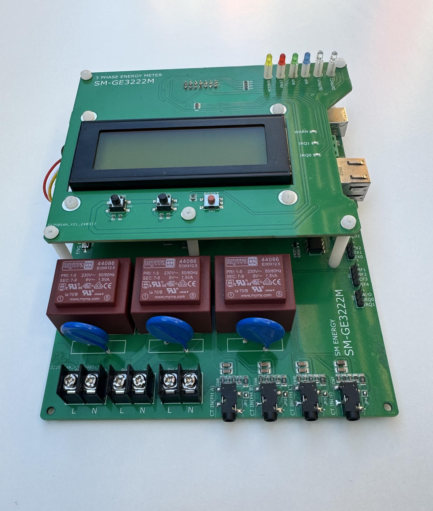
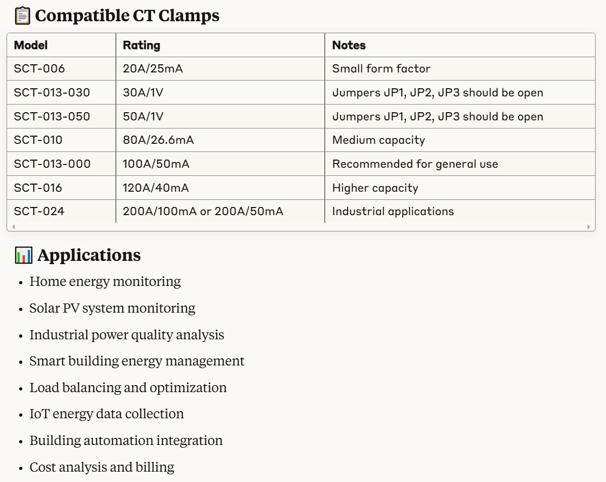
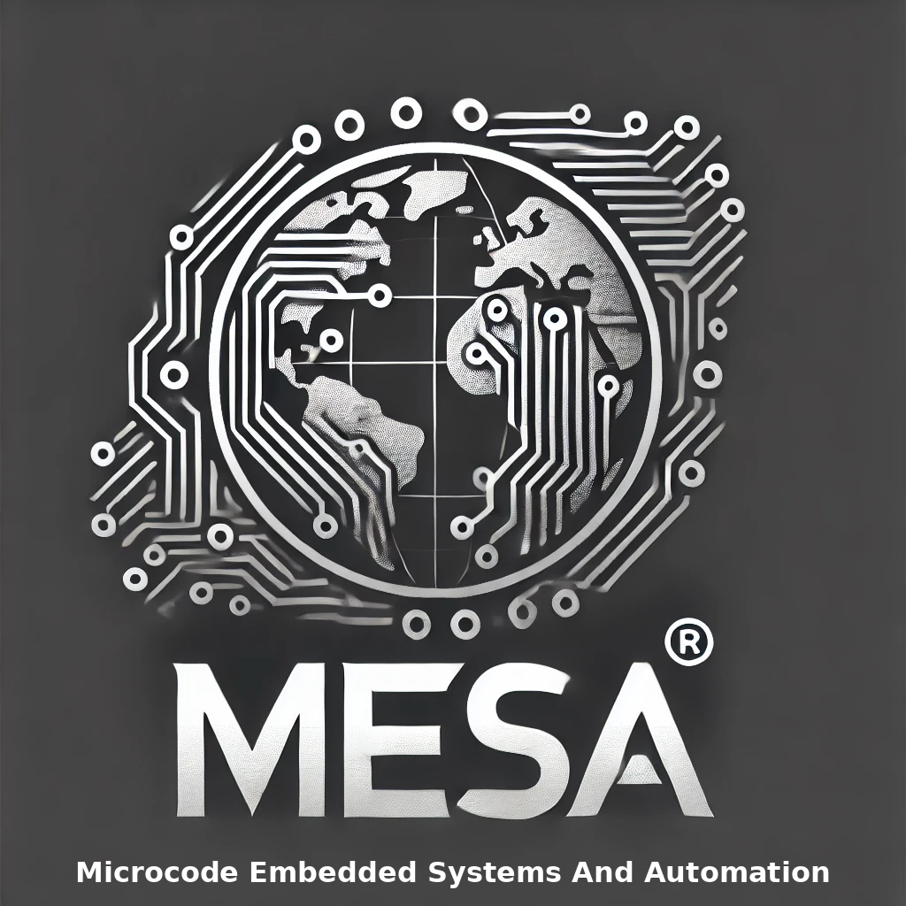

## SM Energy ESP32 based ATM90E36A Arduino Programmable Smart Energy Monitor (Model SM-GE3222M)

[](https://opensource.org/licenses/MIT)
[](https://www.arduino.cc/)
[](https://www.espressif.com/)
[](https://esphome.io/)
[](https://www.home-assistant.io/)
[](https://github.com/mesa-automation/cortex-link-a8r-m/releases)
## 📌 Overview

The SM Energy GE3222M is a flexible dual-purpose smart energy monitoring solution based on the ESP32 platform with ATM90E32/ATM90E36 Energy ICs. It provides accurate measurement of voltage, current, power, energy, and power quality parameters for single and three-phase electrical systems.

<p align="center">






  
</p>


## 🔍 Repository Contents
```
SM-GE3222M-Smart-Energy-Monitor/
├── Documentation/
│   ├── images/
│   │   ├── ge3222m_board.jpg
│   │   └── wiring_diagram.png
│   ├── API_Reference.md
│   ├── CT_Clamp_Selection.md
│   ├── Calibration.md
│   ├── GettingStarted.md
│   ├── Projects.md
│   └── Troubleshooting.md
├── Firmware/
│   ├── Examples/
│   │   ├── BasicEnergyMonitor/
│   │   │   └── BasicEnergyMonitor.ino
│   │   ├── Calibration/
│   │   │   └── Calibration.ino
│   │   ├── CloudIntegration/
│   │   │   ├── AWSIoT/
│   │   │   │   └── AWSIoT.ino
│   │   │   └── ThingSpeak/
│   │   │       └── ThingSpeak.ino
│   │   ├── DataLogging/
│   │   │   ├── EEPROMLogging.ino
│   │   │   └── SDCardLogging.ino
│   │   ├── LCD_Display/
│   │   │   └── LCD_Display.ino
│   │   ├── MODBUS_RTU/
│   │   │   └── MODBUS_RTU.ino
│   │   ├── MultiPhase/
│   │   │   └── ThreePhaseMonitor.ino
│   │   └── WiFiWebServer/
│   │       └── WiFiWebServer.ino
│   └── Libraries/
│       ├── ATM90E32_Arduino/
│       │   ├── src/
│       │   └── examples/
│       └── ATM90E36_Arduino/
│           ├── src/
│           └── examples/
├── Hardware/
│   ├── BOM/
│   │   └── GE3222M_BOM.csv
│   ├── Datasheets/
│   │   ├── ATM90E32.pdf
│   │   ├── ATM90E36.pdf
│   │   ├── ESP32-WROOM-32.pdf
│   │   └── SCT-013-000.pdf
│   ├── Images/
│   │   ├── ge3222m_board_top.jpg
│   │   ├── ge3222m_board_bottom.jpg
│   │   └── ge3222m_dimensions.png
│   └── Schematics/
│       ├── GE3222M_Schematic.pdf
│       └── GE3222M_PCB_Layout.pdf
├── Applications/
│   ├── EspHome/
│   │   └── ge3222m.yaml
│   ├── HomeAssistant/
│   │   └── configuration.yaml
│   ├── MobileApp/
│   │   └── README.md
│   ├── NodeRed/
│   │   └── flows.json
│   └── WebDashboard/
│       ├── index.html
│       ├── script.js
│       └── style.css
├── Certification/
│   ├── CE_Certification.pdf
│   └── RoHS_Compliance.pdf
├── CONTRIBUTING.md
├── LICENSE
└── README.md

```


**SM-GE3222M Smart Power/Energy Monitor Device Overview**

**SM-GE3222M Main Board**


**SM-GE3222M Front LCD Board**


**The SM Energy GE3222M Smart Energy Monitor has the main features:**

The board layout is designed to be a flexible dual-purpose.

ESP32 WROOM, with Internal Antenna, or UF.L connector for external antenna
ATM90E32 or ATM90E36 Energy ICs


## ✨ Key Features

- **ESP32 WROOM 32** - Powerful microcontroller with integrated Wi-Fi and Bluetooth
- **Flexible Energy IC Options**:
  - ATM90E32 for standard 3-phase monitoring
  - ATM90E36 for advanced 3-phase + neutral with DMA mode
- **Multi-phase Monitoring**:
  - 3 x CT clamp inputs for line current (up to 100A with compatible clamps)
  - 3 x voltage inputs (AC RMS)
  - 1 x neutral CT clamp (ATM90E36 only)
- **Onboard Sensors**:
  - DHT22 temperature and humidity sensor
- **Connectivity**:
  - Wi-Fi
  - Bluetooth
  - Ethernet connector
  - MODBUS
- **Interface Options**:
  - I2C 20x4 LCD module support
  - 4x status LEDs
  - 2x user buttons (SET and MODE)
  - 2x opto-isolated digital outputs
- **Data Storage**:
  - 24C64 EEPROM (I2C)
- **Power Supply**:
  - 9-12VDC input
  - Onboard 3.3V DC SMPS power supply
- **Compact Size**:
  - 180 x 140 x 35mm

## 🛠️ Hardware Requirements

- SM Energy GE3222M board
- CT clamps (e.g., YHDC SCT-013-000)
- 9-12VDC power supply
- USB-B cable for programming

## 💻 Software Requirements

- Arduino IDE
- ESP32 board package
- Required libraries:
  - ATM90E32_Arduino
  - ATM90E36_Arduino (if using ATM90E36)
  - Other libraries as needed for examples

## 🚀 Quick Start

### 1. Hardware Setup

1. Connect CT clamps to the appropriate inputs
2. Connect voltage references (if monitoring voltage)
3. Power the board with a 9-12VDC supply

### 2. Software Setup

1. Install Arduino IDE and ESP32 board package
2. Add required libraries
3. Select "ESP32 Dev Module" as the board
4. Connect via USB and upload a sketch

### 3. Example Code

```cpp
#include <ATM90E32.h>

#define CS_PIN 5

ATM90E32 energyMonitor;

void setup() {
  Serial.begin(115200);
  energyMonitor.begin(CS_PIN, LineFreq_50Hz, PGAGain_2x, 0, 0);
}

void loop() {
  float voltage = energyMonitor.GetLineVoltageA();
  float current = energyMonitor.GetLineCurrentA();
  float power = energyMonitor.GetActivePowerA();
  
  Serial.println("Voltage: " + String(voltage) + "V");
  Serial.println("Current: " + String(current) + "A");
  Serial.println("Power: " + String(power) + "W");
  
  delay(1000);
}

```

All test code is OPEN SOURCE and although it is not intended for real-world use, it may be freely used, or modified as needed.  It is distributed on an "AS IS" BASIS, WITHOUT WARRANTIES OR CONDITIONS OF ANY KIND, either express or implied.

See Example Code https://github.com/Chamil1983/SM-GE3222M-Smart-Energy-Monitor/blob/main/Examples/


## **Further Information**

For more detailed setup instructions, see the .




Additional information and other technical details on this project may be found in the related repository pages.

## 🤝 Contributing

Contributions to improve the code examples, documentation, or add new features are welcome. Please see [CONTRIBUTING.md](Documentation/CONTRIBUTING.md) for guidelines.

## 📄 License
This project is distributed under the MIT License. See the [LICENSE](LICENSE) file for more details.

**Repository Folders**

 - **Code** *(Code examples for Arduino  IDE and Visual Studio)*
 - **Datasheets and Information** *(Component Datasheets, Photos and Technical Documentation)*
 - **Certification** *(Related Repository Project or Part, Certification Information)*

## ⚠️ Safety Warning

Always ensure proper safety precautions when working with electrical systems. All electrical connections should be made by a qualified electrician in compliance with local regulations

## 📧 Contact & Support
- Purchase: [SM Energy GE3222M on eBay](https://www.ebay.com.au/itm/364952547719)

- Technical Support: Open an issue on this repository

- Contact: Chamil Vithanage, Microcode Embedded Solutions, Australia

For technical support, please contact MESA:

- **Website:** [www.microcodeeng.com](https://www.microcodeeng.com)
- **Email:** microcode-eng@outlook.com

For issues related to this repository, please open an issue on GitHub.

---

<p align="center">
  <br>

  <I align="center">Designed and manufactured by Microcode Embedded Systems and Automation (MESA)</i>
</p>

***Chamil Vithanage, Microcode Embedded Solutions, Australia.***

Electronics Engineer | Software Developer | R&D Support | RF Engineering | Product Certification and Testing 

© 2025 Microcode Embedded Solutions | Electronics Engineer | Software Developer | R&D Support
